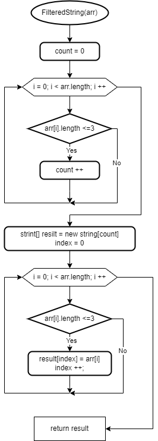

# Итоговая контрольная работа по основному блоку

Эта программа на C# предназначена для фильтрации массива строк по их длине. Она позволяет пользователю ввести массив строк с клавиатуры, разделенный запятыми, либо задать массив заранее. Затем программа формирует новый массив, включающий только те строки из исходного массива, длина которых меньше или равна 3 символам.

Программа использует два цикла: первый для определения количества строк, которые удовлетворяют условию, и второй для фактической фильтрации строк и создания нового массива. Результат выводится на экран, предоставляя пользователю исходный и отфильтрованный массивы строк.

